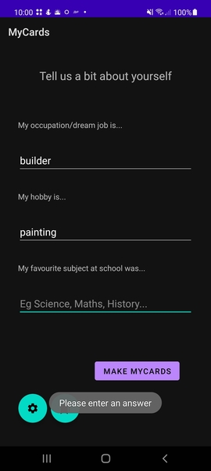
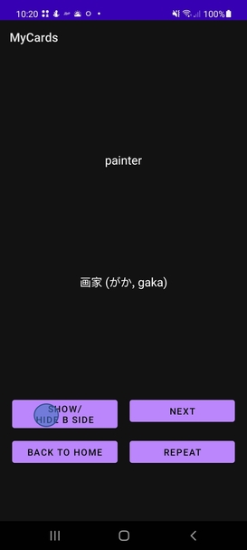
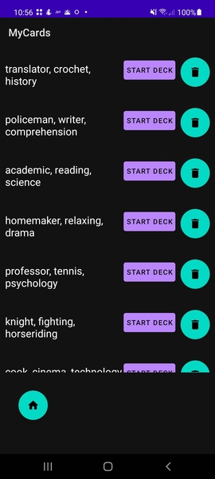
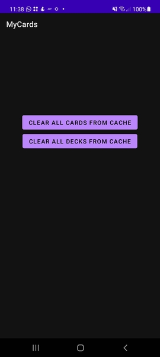

# MyCards

MyCards is a flashcard application for learning Japanese, written for Kitty Ho's MSc Computer Science project. 
The difference from normal flashcard applications is that instead of requiring that you source the words for the flashcards 
and make them manually yourself, the app will take the words you put in, find related ones and create the cards for you. 
The premise is that the app will ask you for information about yourself (what is your job? Hobbies? Favourite subject at school?). 
It will use those words to find relevant words that you can learn to use in a conversation about yourself with a Japanese speaker.

## System Requirements
+ Your Android device must be at least Android SDK Level 30. 
  Some of MyCards core functionality requires this level of API, so we cannot guarantee 
  that it will work on lower versions. 

## App Features
+ Accepts English words as input, which is used as the search term for finding semantically similar words.
A toast will show if you do not enter a response in a blank field.

+ Practice vocabulary. The English word will show at the top and you can press a button to show/hide the Japanese word.
At present, there's no back functionality, so make sure you're content with the word you're practising before you press 'Next'!

+ You can repeat whole decks by pressing the bookmark icon on the home page to go to the repeat deck screen.

 

+ Manage your decks of flashcard by pressing the trashcan icon next to each deck on the repeat deck screen. Or, to clear everything at once,
you can press the cog icon from the home screen to access the clear all buttons. 

## Upcoming App Features (coming soon...)
 - [ ] Repeat button on the practice screen will allow users to select individual cards for repetition at the end of the deck.  
 - [ ] Back button on practice screen, so users can navigate forwards and backwards within a deck.
 - [ ] A count of total cards in the corner of the practice screen, so users can see the total cards in the deck.
 - [ ] A bespoke finish screen with some animation.

## Future Improvements

### More App Features (coming less soon...)
+ An Activity-hosted AppBar to store Settings (Maintenance) page, return to Home (InputFragment) easily,
  and show licences/about page (TBC). See: https://developer.android.com/guide/fragments/appbar?hl=en&authuser=1.
+ A splash screen at start up.
+ A card counter on the repeat deck screen. Complexity to consider: syncing if Cards are deleted. 
  Atm, Cards and Decks are entirely independent (deleting Cards does not delete/alter their Decks;
  deleting Decks does not remove the Cards).
+ Ways to pre-process user input Strings for better results:
    + Spellcheck function OR
    + Dropdown that shows pre-loaded words from jmdict db (so autocomplete function), 
      to encourage users to input only those words that would have a jmdict entry.  
      
### Dev Stuff
+ Use View Binding to replace findViewById. Can improve performance/prevent memory leaks: 
  https://developer.android.com/topic/libraries/view-binding.
+ Migrate from Dagger to DaggerHilt and reduce boilerplate code. 
  This will also help with implementing SavedStateHandle in ViewModel.
+ Leverage the power of new Android class SavedStateHandle in ViewModel to handle Fragment state which is not complex
  and should be stored beyond app process destruction (after VM is destroyed) but is too trivial to be persisted to local store.  
+ Investigate how to manipulate Fragment lifecycle to enable postponed Fragments between Fragment transitions,
  so that when loading takes time (eg remote server API call), the whole Fragment can be postponed until ready.
+ Investigate reducing boilerplate by refactoring to remove layers that may be redundant eg now we have a use case layer, 
  do we need the repositories?
+ Decouple the deck use case from the card use case to avoid SharedViewModel and/or UseCaseManager becoming a God Object. 
+ More tests...
  
 
## Attributions

MyCards uses the Datamuse API for its semantic search functionality, having received permission to use it for the purposes of this project: https://www.datamuse.com/api/.

This app uses a variation of the [JMdict](http://www.edrdg.org/wiki/index.php/JMdict-EDICT_Dictionary_Project) dictionary files. These files are the property of the [Electronic Dictionary Research and Development Group](http://www.edrdg.org/), 
and are used in conformance with the Group's [licence](http://www.edrdg.org/edrdg/licence.html). The variation used was based on the JSON file created by [scriptin](https://github.com/scriptin/jmdict-simplified) but with significant modifications that are my own.

This Android project uses other technologies including Jackson, Dagger2, Mockito and Retrofit, which each have their own Open Source licence. 

## Licence

Copyright 2021 Kitty Ho

Licensed under the Apache License, Version 2.0 (the "License");
you may not use this file except in compliance with the License.
You may obtain a copy of the License at

       http://www.apache.org/licenses/LICENSE-2.0

Unless required by applicable law or agreed to in writing, software
distributed under the License is distributed on an "AS IS" BASIS,
WITHOUT WARRANTIES OR CONDITIONS OF ANY KIND, either express or implied.
See the License for the specific language governing permissions and
limitations under the License.
